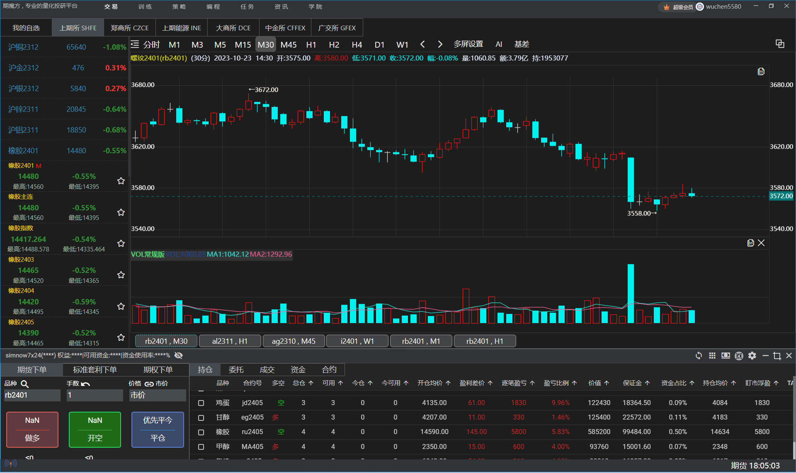

# [期魔方]()

## 关于期魔方

期魔方是由四川汇一创科信息技术有限公司研发的一款期货量化投研平台，适用于国内期货的主观、预警、量化交易。

平台支持自主指标编写，策略模型开发，复盘回测等功能，并有策略商城，供用户下载学习。

## 产品优势

期魔方量化投研平台，立志于专业的量化角度，以更简洁的界面和操作流程，最大程度降低用户的量化使用门槛，实现初学者也能快速入门量化领域，成为专业投资者。